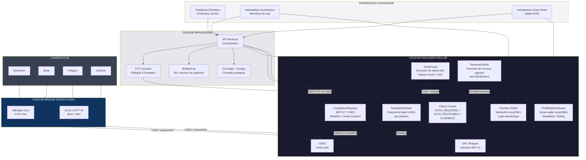
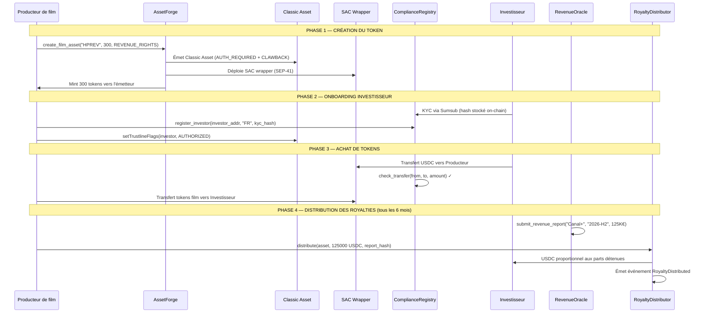
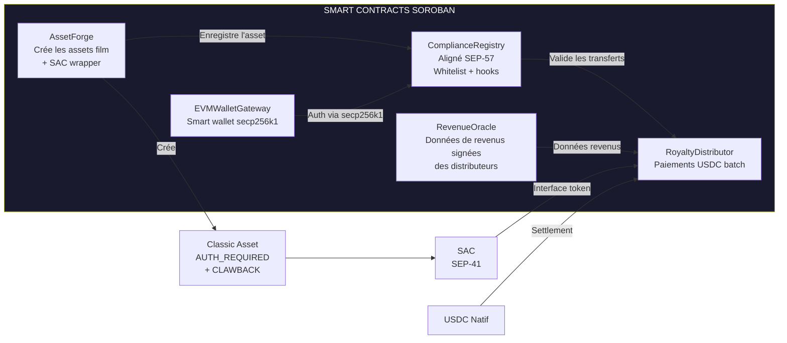
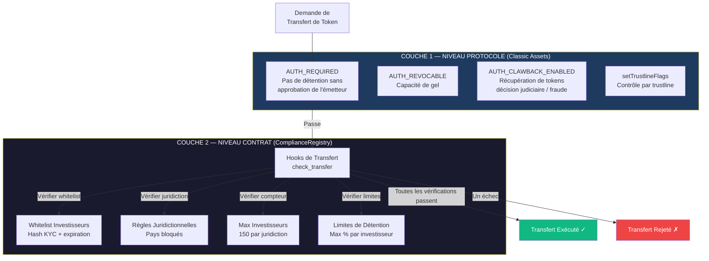
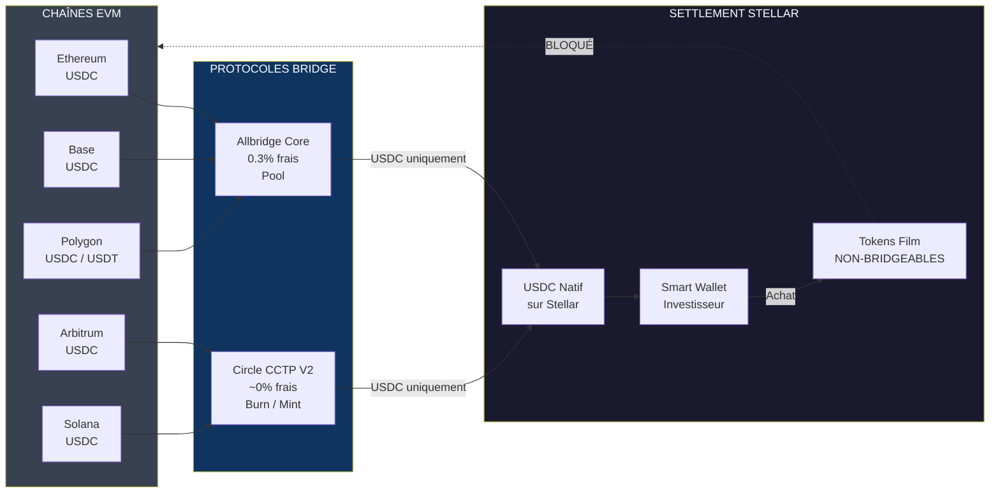
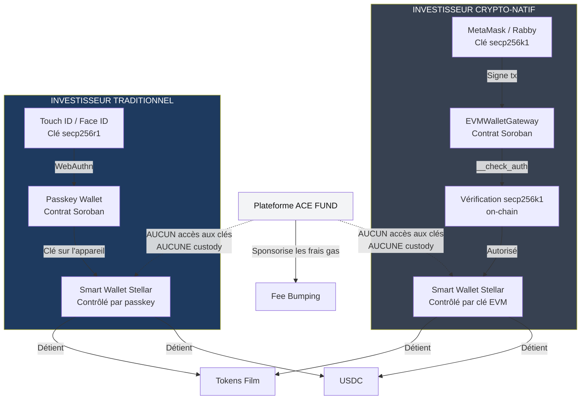
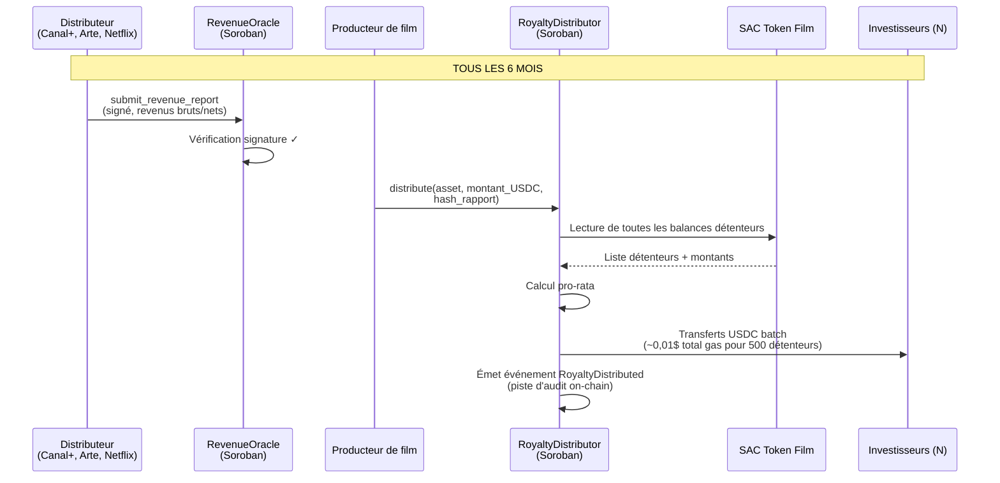
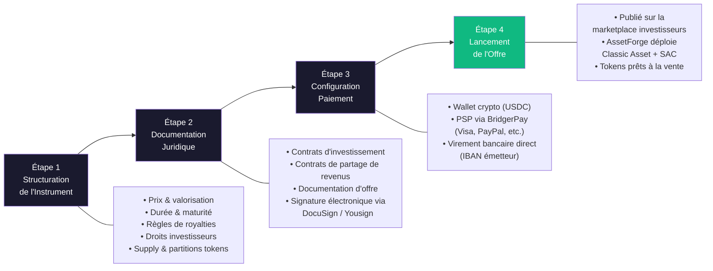
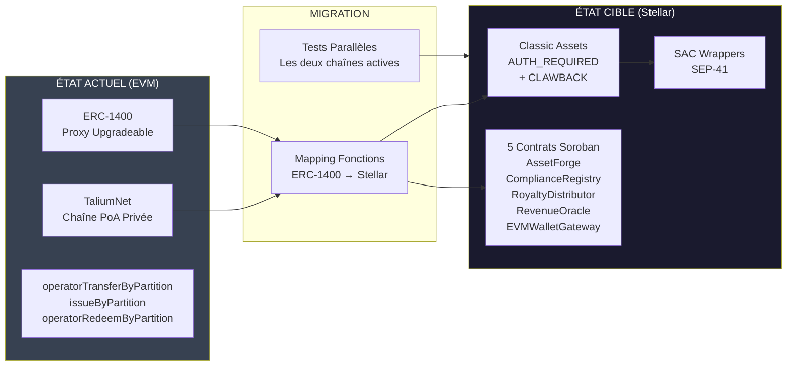

# Architecture Technique — ACE FUND

## Infrastructure de Tokenisation de Films Régulés sur Stellar

---

**Projet :** ACE FUND (par ACE Good)
**Catégorie :** RWA — Droits Audiovisuels & Royalties Tokenisés
**Track :** Open Track — Build Award
**Site web :** [acefund.io](https://www.acefund.io)

---

## Table des matières

1. [Résumé exécutif](#1-résumé-exécutif)
2. [Problématique](#2-problématique)
3. [Vue d'ensemble de la solution](#3-vue-densemble-de-la-solution)
4. [Pourquoi Stellar](#4-pourquoi-stellar)
5. [Architecture On-Chain](#5-architecture-on-chain)
6. [Architecture des Smart Contracts](#6-architecture-des-smart-contracts)
7. [Flux de Tokenisation](#7-flux-de-tokenisation)
8. [Architecture de Compliance](#8-architecture-de-compliance)
9. [Bridge de Liquidité Cross-Chain](#9-bridge-de-liquidité-cross-chain)
10. [Architecture Wallet](#10-architecture-wallet)
11. [Moteur de Distribution des Royalties](#11-moteur-de-distribution-des-royalties)
12. [Infrastructure Off-Chain](#12-infrastructure-off-chain)
13. [Modèle de Sécurité](#13-modèle-de-sécurité)
14. [Composabilité DeFi](#14-composabilité-defi)
15. [Stratégie de Migration ERC-1400 → Stellar](#15-stratégie-de-migration-erc-1400--stellar)

---

## 1. Résumé exécutif

ACE FUND est une plateforme SaaS qui permet aux producteurs de films de tokeniser des droits sur recettes (royalties, entrées en salle, droits de diffusion TV) et de vendre des parts fractionnées à des investisseurs. La plateforme opère depuis 2023 sur une chaîne EVM privée (TaliumNet/Hyperledger Besu), avec **plus de 1,2M€ de transactions on-chain** sur 5 projets de films tokenisés, utilisant le standard de security tokens ERC-1400.

Cette soumission demande un financement pour **migrer et étendre l'infrastructure de tokenisation vers Stellar**, en remplaçant la chaîne EVM privée par un réseau public, tout en ajoutant une compliance on-chain native, un accès à la liquidité cross-chain et une distribution automatisée des royalties via des smart contracts Soroban.

**Métriques clés :**
- 500K€ de droits TV tokenisés (200 tokens × 2 500€, rendement annuel 25%+)
- 700K€ tokenisés sur une seule production cinématographique (budget 1,5M)
- 5 projets de films tokenisés, 15+ en pipeline
- Prix d'Innovation CES Las Vegas 2024
- Réseau de 100+ réalisateurs et producteurs
- Conférencier invité à l'Académie des Oscars et au Festival de Cannes

---

## 2. Problématique

Le financement du cinéma repose sur des instruments opaques et illiquides, accessibles uniquement aux investisseurs institutionnels ou aux personnes fortunées. Les producteurs indépendants avec des gaps de financement de 10% (typiquement 150K€–1,5M€) n'ont aucun mécanisme efficace pour atteindre les investisseurs particuliers.

**Limitations actuelles sur la chaîne EVM privée :**

| Problème | Impact |
|----------|--------|
| Chaîne PoA privée (TaliumNet) | Aucune vérifiabilité publique, confiance limitée |
| Pas de stablecoin natif | Friction on/off-ramp fiat, pas de settlement USDC |
| Écosystème fermé | Pas d'accès à la liquidité DeFi ni aux pools de capitaux institutionnels |
| Dépendance tierce | Talium opère la chaîne, ACE FUND n'a aucune souveraineté |
| Investisseurs EVM uniquement | Exclut le capital institutionnel natif Stellar (Franklin Templeton, SG Forge, etc.) |

---

## 3. Vue d'ensemble de la solution

Migration de la chaîne EVM privée vers le réseau public Stellar en utilisant une architecture hybride Classic Asset + Soroban.

### Architecture Globale



### Cycle de Vie du Token Film



---

## 4. Pourquoi Stellar

Stellar n'est pas interchangeable avec d'autres chaînes pour ce cas d'usage. Les fonctionnalités suivantes sont **structurellement nécessaires** et soit indisponibles, soit prohibitivement coûteuses sur les chaînes EVM :

### 4.1 Modèle d'Autorisation Natif

Les tokens de royalties de films sont des titres financiers réglementés. Chaque transfert doit être pré-approuvé par l'émetteur. Le flag `AUTH_REQUIRED` de Stellar permet cela **au niveau du protocole**, pas via un contournement par smart contract :

- `AUTH_REQUIRED` : aucun wallet ne peut détenir de tokens sans approbation explicite de l'émetteur
- `AUTH_REVOCABLE` : l'émetteur peut geler les tokens en cas d'action réglementaire ou de non-conformité de l'investisseur
- `AUTH_CLAWBACK_ENABLED` : l'émetteur peut récupérer les tokens en cas de fraude ou de décision judiciaire — une exigence légale pour les titres financiers dans l'UE

Sur Ethereum, ces fonctionnalités nécessitent une logique ERC-1400 custom qui ajoute des coûts de gas et de la surface d'attaque. Sur Stellar, ce sont des **opérations natives du protocole** sans complexité additionnelle.

### 4.2 Authorization Sandwich Pattern

Pour l'approbation au cas par cas des transferts de titres réglementés :

```
1. L'émetteur autorise l'expéditeur (AUTHORIZED_FLAG)
2. L'émetteur autorise le destinataire (AUTHORIZED_FLAG)
3. Le paiement s'exécute
4. L'émetteur réduit le destinataire à AUTHORIZED_TO_MAINTAIN_LIABILITIES
5. L'émetteur réduit l'expéditeur à AUTHORIZED_TO_MAINTAIN_LIABILITIES
```

Chaque transfert est individuellement approuvé. C'est le modèle réglementaire exact requis pour les transferts de titres sous MiFID II. Sur Stellar, c'est une transaction atomique native de 5 opérations. Sur EVM, cela nécessite des hooks custom, des modifiers et des changements d'état coûteux en gas.

### 4.3 Classic Asset + SAC : le meilleur des deux mondes

- **Émission Classic Asset** : native, efficace en gas (~0,00001$/tx), avec autorisation et clawback intégrés
- **SAC (Stellar Asset Contract)** : wrappe le Classic Asset pour exposer l'interface token SEP-41 à Soroban, permettant la composabilité avec la logique smart contract (hooks de compliance, distribution, oracle)
- Cette double couche est unique à Stellar : **sécurité au niveau protocole + programmabilité smart contract**

### 4.4 USDC Natif

Circle émet l'USDC **directement sur Stellar** — pas wrappé, pas bridgé, entièrement natif. Cela permet :
- Settlement en USDC sans risque de bridge
- Distribution des royalties directement en USDC dans les wallets des investisseurs
- Off-ramp fiat via les anchors Stellar (MoneyGram, partenaires locaux) dans 100+ pays
- CCTP V2 pour les transferts USDC natifs cross-chain (burn/mint, pas de wrapped tokens)

### 4.5 Structure de Coûts

Les distributions de royalties nécessitent des paiements batch à des centaines d'investisseurs tous les 6 mois. Au tarif de ~0,00001$/tx de Stellar, distribuer à 500 investisseurs coûte < 0,01$. Sur le mainnet Ethereum, la même opération coûte 50–500$+ selon le prix du gas.

### 4.6 Écosystème Institutionnel

Stellar héberge Franklin Templeton (580M$+ de bons du Trésor tokenisés), SG Forge (EUR CoinVertible), PayPal (PYUSD). Les tokens de royalties de films sur Stellar côtoient des RWA de qualité institutionnelle — augmentant la crédibilité et l'accès au capital LP institutionnel.

---

## 5. Architecture On-Chain

### 5.1 Modèle d'Asset

Chaque film ou catalogue est représenté comme un **Stellar Classic Asset** avec la configuration de compte émetteur suivante :

```
Compte Émetteur (par film)
├── AUTH_REQUIRED_FLAG         = true
├── AUTH_REVOCABLE_FLAG        = true
├── AUTH_CLAWBACK_ENABLED_FLAG = true
├── Home Domain                = acefund.io
└── Asset Code                 = ex. HPRES (High Pressure), MDFCATALOG
```

Le Classic Asset est ensuite wrappé via SAC pour exposer l'interface SEP-41 :

```bash
stellar contract asset deploy \
  --source <keypair_émetteur> \
  --network mainnet \
  --asset HPRES:<clé_publique_émetteur>
```

La paire de clés du compte émetteur est détenue par le **producteur de film** (l'émetteur légal des titres), pas par ACE FUND. ACE FUND fournit l'outillage ; le producteur conserve la souveraineté.

### 5.2 Modèle de Partitions (Équivalent ERC-1400)

Sur la plateforme EVM actuelle, les tokens film utilisent les partitions ERC-1400 pour séparer différentes tranches du même film (ex. "droits sur recettes" vs "droits de propriété intellectuelle"). Sur Stellar, les partitions sont implémentées comme des **Classic Assets séparés émis par le même compte émetteur** :

```
Film : "High Pressure" (Émetteur : GFILM...)
├── HPREV (Droits sur Recettes) — 300 tokens × 5 000€
├── HPCAT (Droits Catalogue) — tranche future
└── Chaque asset : AUTH_REQUIRED + CLAWBACK + SAC wrapper
```

Cela préserve la sémantique des partitions ERC-1400 tout en tirant parti du modèle d'assets natif de Stellar. Le contrat Soroban `AssetForge` automatise la création et la configuration de ces partitions.

---

## 6. Architecture des Smart Contracts

Cinq contrats Soroban principaux orchestrent le cycle de vie on-chain :

### 6.1 Vue d'ensemble des Contrats



### 6.2 AssetForge

**Objectif :** Automatise la création de partitions de tokens film sur Stellar.

**Fonctions :**

```rust
pub fn create_film_asset(
    env: Env,
    issuer: Address,          // Producteur de film (doit autoriser)
    asset_code: String,       // ex. "HPREV"
    total_supply: i128,       // ex. 300 tokens
    partition_type: Symbol,   // REVENUE_RIGHTS | CATALOG_RIGHTS | IP_RIGHTS
    metadata_hash: BytesN<32> // Hash IPFS du contrat juridique
) -> Address;                 // Retourne l'adresse du contrat SAC

pub fn configure_issuer_flags(
    env: Env,
    issuer: Address
);
// Configure AUTH_REQUIRED + AUTH_REVOCABLE + AUTH_CLAWBACK_ENABLED
// sur le compte émetteur via opérations Stellar

pub fn get_film_assets(
    env: Env,
    issuer: Address
) -> Vec<FilmAsset>;
// Retourne toutes les partitions pour un émetteur donné
```

**Stockage :** Le stockage persistent mappe `issuer → Vec<FilmAsset>` où `FilmAsset` inclut le code asset, l'adresse SAC, le supply total, le type de partition et le timestamp de création.

### 6.3 ComplianceRegistry (Aligné SEP-57 / T-REX)

**Objectif :** Application on-chain de la whitelist investisseurs et des restrictions de transfert. Aligné avec le framework T-REX (ERC-3643 adapté à Stellar via SEP-57).

**Conception :**

```rust
pub fn register_investor(
    env: Env,
    issuer: Address,         // Seul le producteur peut enregistrer
    investor: Address,       // Adresse Stellar (Account ou Contract)
    jurisdiction: Symbol,    // Code pays ISO 3166-1
    kyc_hash: BytesN<32>,   // Hash du résultat de vérification KYC
    expiry: u64             // Timestamp de validité KYC
) -> Result<(), ComplianceError>;

pub fn revoke_investor(
    env: Env,
    issuer: Address,
    investor: Address
) -> Result<(), ComplianceError>;

pub fn check_transfer(
    env: Env,
    asset: Address,          // Adresse SAC du token film
    from: Address,
    to: Address,
    amount: i128
) -> Result<bool, ComplianceError>;
// Vérifie :
// 1. Expéditeur et destinataire sont whitelistés
// 2. Le KYC du destinataire n'a pas expiré
// 3. Les restrictions juridictionnelles sont respectées
// 4. Le nombre max d'investisseurs par asset n'est pas dépassé (150/juridiction)
// 5. Les limites de détention sont respectées

pub fn is_whitelisted(
    env: Env,
    investor: Address,
    asset: Address
) -> bool;

pub fn get_investor_count(
    env: Env,
    asset: Address,
    jurisdiction: Symbol
) -> u32;
// Retourne le nombre d'investisseurs enregistrés par juridiction
// Utilisé pour appliquer la limite de 150 investisseurs du placement privé
```

**Règles de compliance (configurables par asset) :**

| Règle | Description | Défaut |
|-------|-------------|--------|
| `max_investors_per_jurisdiction` | Limite Règlement Prospectus UE | 150 |
| `max_holding_pct` | % maximum du supply total par investisseur | 10% |
| `blocked_jurisdictions` | Pays sanctionnés (OFAC, UE) | Configurable |
| `kyc_expiry_days` | Période de validité KYC | 365 jours |
| `transfer_cooldown` | Période de détention minimum | 0 (configurable) |

**Intégration avec l'autorisation Classic Asset :**

Le `ComplianceRegistry` fonctionne en tandem avec le flag `AUTH_REQUIRED` de l'émetteur. Quand un investisseur est enregistré :

1. `register_investor()` stocke l'investisseur dans la whitelist on-chain
2. Le backend de la plateforme appelle `setTrustlineFlags(AUTHORIZED_FLAG)` sur la trustline de l'investisseur
3. Les transferts sont doublement vérifiés : niveau protocole (`AUTH_REQUIRED`) + niveau contrat (`check_transfer()`)

Cette application double couche assure la compliance même si le contrat Soroban est contourné via une opération Classic Asset directe.

### 6.4 RoyaltyDistributor

**Objectif :** Automatise les paiements batch de royalties en USDC à tous les détenteurs de tokens d'un asset film donné, proportionnellement à leurs parts.

**Fonctions :**

```rust
pub fn distribute(
    env: Env,
    issuer: Address,             // Doit autoriser
    asset: Address,              // Adresse SAC du token film
    usdc_amount: i128,           // USDC total à distribuer
    revenue_report_hash: BytesN<32> // Hash du rapport de revenus signé
) -> DistributionResult;
// 1. Lit tous les détenteurs de tokens depuis les entrées de balance SAC
// 2. Calcule la part pro-rata par détenteur
// 3. Exécute les transferts USDC batch via SAC
// 4. Émet un événement de distribution avec le détail complet
// 5. Lie au hash du rapport de revenus pour l'auditabilité

pub fn get_distribution_history(
    env: Env,
    asset: Address
) -> Vec<Distribution>;

pub fn get_investor_earnings(
    env: Env,
    investor: Address,
    asset: Address
) -> i128;
// USDC cumulé reçu par cet investisseur pour ce film
```

**Événements de distribution :**

```rust
#[contractevent]
pub struct RoyaltyDistributed {
    #[topic]
    asset: Address,
    #[topic]
    period: Symbol,          // ex. "2026-H1"
    total_usdc: i128,
    holders_count: u32,
    revenue_hash: BytesN<32>,
}
```

**Optimisation gas :** Pour les films avec 300 détenteurs de tokens, une distribution nécessite ~300 transferts USDC. Avec la structure de frais de Stellar, le coût total est < 0,01$. Le contrat traite les détenteurs par lots pour rester dans les limites de ressources par transaction de Soroban (200 entrées en écriture post-SLP-0004).

### 6.5 RevenueOracle

**Objectif :** Publication on-chain de données de revenus vérifiées provenant des distributeurs de films (chaînes TV, cinémas, plateformes de streaming). Assure le pont physique-digital — le facteur différenciant #1 pour les projets RWA acceptés.

**Fonctions :**

```rust
pub fn submit_revenue_report(
    env: Env,
    reporter: Address,            // Distributeur ou auditeur autorisé
    asset: Address,               // Adresse SAC du token film
    period: Symbol,               // "2026-H1"
    gross_revenue: i128,          // En centimes (EUR ou USD)
    net_distributable: i128,      // Après déductions
    report_hash: BytesN<32>,      // Hash IPFS du rapport complet
    signature: BytesN<64>         // Signature Ed25519 du rapport
) -> Result<(), OracleError>;

pub fn add_authorized_reporter(
    env: Env,
    admin: Address,
    reporter: Address,
    name: String                  // ex. "Canal+", "Arte"
) -> Result<(), OracleError>;

pub fn get_latest_report(
    env: Env,
    asset: Address
) -> Option<RevenueReport>;

pub fn get_cumulative_revenue(
    env: Env,
    asset: Address
) -> i128;
```

**Modèle de confiance :** Les rapports de revenus sont soumis par des distributeurs autorisés (chaînes TV, agents de vente) ou des auditeurs tiers. Chaque rapporteur est pré-enregistré via `add_authorized_reporter()`. Les rapports sont signés off-chain et la signature est vérifiée on-chain, assurant la provenance des données.

### 6.6 EVMWalletGateway

**Objectif :** Contrat smart wallet qui permet aux investisseurs disposant de wallets EVM (MetaMask, Rabby) d'interagir avec Stellar sans gérer une paire de clés Stellar séparée.

**Mécanisme :**

```rust
impl CustomAccountInterface for EVMWalletGateway {
    type Signature = BytesN<65>; // Signature secp256k1 (r, s, v)
    type Error = GatewayError;

    fn __check_auth(
        env: Env,
        signature_payload: Hash<32>,
        signature: Self::Signature,
        auth_context: Vec<Context>,
    ) -> Result<(), Self::Error> {
        // 1. Récupère la clé publique secp256k1 depuis la signature
        // 2. Dérive l'adresse Ethereum (keccak256 de la pubkey)
        // 3. Vérifie qu'elle correspond à l'adresse EVM enregistrée
        // 4. Vérifie que la signature couvre le bon payload
    }
}

pub fn register(
    env: Env,
    evm_address: BytesN<20>,     // Adresse Ethereum 0x...
    proof: BytesN<65>            // Signature prouvant la propriété
) -> Address;
// Crée une nouvelle instance de contrat smart wallet
// Retourne l'adresse du contrat Stellar (C...)
// La clé privée EVM est le SEUL signataire — self-custody

pub fn get_stellar_address(
    env: Env,
    evm_address: BytesN<20>
) -> Option<Address>;
```

**Garantie de self-custody :** Le contrat smart wallet ne peut être opéré QU'EN produisant une signature secp256k1 valide depuis l'adresse Ethereum enregistrée. ACE FUND n'a jamais accès à aucune clé privée. L'investisseur signe les transactions avec MetaMask/Rabby, et la fonction `__check_auth` vérifie la signature on-chain.

---

## 7. Flux de Tokenisation

### 7.1 Onboarding Film (Côté Émetteur)

```
Producteur (Émetteur)
      │
      ▼
1. Crée un compte sur la plateforme ACE FUND
2. Upload la documentation juridique (contrat de partage de revenus, budget du film)
3. Signe via DocuSign/Yousign
      │
      ▼
4. ACE FUND génère une paire de clés Stellar pour l'émetteur
   (ou lie un compte Stellar existant)
5. AssetForge.create_film_asset() est appelé :
   - Crée un Classic Asset avec AUTH_REQUIRED + CLAWBACK
   - Déploie le SAC wrapper
   - Enregistre les métadonnées de l'asset (hash IPFS du contrat juridique)
   - Mint le supply total vers le compte émetteur
      │
      ▼
6. Le film est listé sur la marketplace ACE FUND
   Les tokens sont prêts à la vente
```

### 7.2 Flux d'Investissement (Côté Investisseur)

**Investisseur natif Stellar ou traditionnel :**

```
Investisseur
   │
   ▼
1. Crée un compte (email + passkey)
   → Wallet passkey Soroban créé automatiquement (WebAuthn)
   → Clé privée stockée sur l'appareil (Touch ID / Face ID)
   → Self-custody, ACE FUND n'a aucun accès aux clés
   │
   ▼
2. KYC via Sumsub (délégué au producteur de film)
   → En cas de succès : ComplianceRegistry.register_investor()
   → L'adresse Stellar de l'investisseur est whitelistée on-chain
   → L'émetteur configure trustline AUTHORIZED_FLAG
   │
   ▼
3. Paiement : fiat via BridgerPay → on-ramp vers USDC via anchor Stellar
   ou : USDC sur Stellar directement
   │
   ▼
4. Achat : USDC transféré à l'émetteur, tokens film transférés à l'investisseur
   → ComplianceRegistry.check_transfer() valide le transfert
   → AUTH_REQUIRED assure l'application au niveau protocole
   → Les tokens arrivent dans le wallet passkey de l'investisseur
```

**Investisseur natif EVM :**

```
Investisseur EVM (MetaMask / Rabby)
   │
   ▼
1. Connecte son wallet EVM sur la plateforme ACE FUND
   → EVMWalletGateway.register() crée un smart wallet Soroban
   → Le wallet est contrôlé par la clé privée EVM de l'investisseur (secp256k1)
   → Self-custody : personne d'autre ne peut signer les transactions
   │
   ▼
2. KYC via Sumsub → ComplianceRegistry.register_investor()
   (identique au cas ci-dessus, en utilisant l'adresse du smart wallet Stellar)
   │
   ▼
3. Bridge USDC depuis la chaîne EVM vers Stellar :
   → Allbridge Core ou Circle CCTP V2 intégré dans l'UI de la plateforme
   → L'investisseur signe la transaction bridge avec MetaMask (chaîne source)
   → L'USDC arrive sur son smart wallet Stellar
   │
   ▼
4. Achat : identique au cas ci-dessus
   → L'investisseur signe avec MetaMask
   → EVMWalletGateway.__check_auth() vérifie la signature secp256k1
   → La transaction s'exécute sur Stellar
```

---

## 8. Architecture de Compliance

### 8.1 Cadre Réglementaire

ACE FUND opère sous l'**exemption de placement privé de l'UE** (Règlement UE 2017/1129) :

| Exigence | Implémentation |
|----------|----------------|
| < 150 investisseurs par État membre UE | `ComplianceRegistry.max_investors_per_jurisdiction` appliqué on-chain |
| < 8M€ de contrepartie totale par 12 mois | Suivi off-chain par émetteur ; plafond on-chain configurable |
| Pas de sollicitation publique | Modèle club privé (adhésion requise) |
| Vérification KYC/AML | Intégration Sumsub, déléguée à l'émetteur (producteur) |
| Self-custody (pas de licence de conservation requise) | Passkey wallets (WebAuthn) + EVMWalletGateway (secp256k1) |

**Position réglementaire d'ACE FUND :** ACE FUND est un **fournisseur de technologie** (plateforme SaaS), pas un intermédiaire d'investissement. Le producteur de film est l'émetteur légal des titres et assume la responsabilité KYC/AML. ACE FUND fournit l'infrastructure (smart contracts, UI marketplace, intégration SDK KYC) mais ne détient ni tokens, ni fonds, ni données investisseurs.

### 8.2 Application de la Compliance On-Chain

**Modèle double couche :**



**Pourquoi deux couches :** La couche 1 intercepte toute tentative de transfert de tokens via des opérations Classic Asset directes (contournant Soroban). La couche 2 ajoute la logique métier granulaire (vérifications juridictionnelles, limites de détention) que les Classic Assets ne peuvent pas exprimer. Ensemble, elles fournissent une **défense en profondeur**.

### 8.3 Restriction de Bridgeabilité des Tokens

Les tokens de royalties de films sont **non-bridgeables par conception**. Le flag `AUTH_REQUIRED` empêche tout wallet (y compris les contrats de bridge) de détenir des tokens sans approbation explicite de l'émetteur. Les contrats de bridge ne seront jamais whitelistés dans le `ComplianceRegistry`.

**Seul l'USDC est bridgeable.** Les investisseurs peuvent bridger la liquidité IN (USDC de n'importe quelle chaîne → Stellar) et bridger la liquidité OUT (USDC de Stellar → n'importe quelle chaîne). Les security tokens restent sur Stellar en permanence, sous application complète de la compliance.

---

## 9. Bridge de Liquidité Cross-Chain

### 9.1 Architecture



**Direction :** L'USDC entre pour l'investissement, sort pour les distributions/sorties. Les tokens film sont **non-bridgeables** — ils restent sur Stellar sous application complète de la compliance en permanence.

### 9.2 Routes Supportées

| Chaîne Source | Bridge | Token | Statut |
|--------------|--------|-------|--------|
| Ethereum | Allbridge Core | USDC, USDT | Live |
| Base | Allbridge Core | USDC | Live |
| Polygon | Allbridge Core | USDC, USDT | Live |
| Arbitrum | Allbridge Core | USDC | Live |
| Solana | Allbridge Core | USDC | Live |
| Toute chaîne CCTP | Circle CCTP V2 | USDC (natif) | Q1 2026 |

### 9.3 Expérience Utilisateur

Le bridge est **intégré dans l'UI de la plateforme ACE FUND**. L'investisseur n'interagit pas directement avec Allbridge ou CCTP :

1. L'investisseur clique "Déposer depuis EVM" dans le dashboard ACE FUND
2. Le popup MetaMask/Rabby demande l'approbation du transfert USDC sur la chaîne source
3. La plateforme route le transfert via Allbridge Core ou CCTP V2
4. La trustline pour l'USDC sur Stellar est automatiquement établie si nécessaire
5. L'USDC arrive sur le wallet Stellar de l'investisseur en 1-5 minutes
6. L'investisseur peut immédiatement acheter des tokens film

---

## 10. Architecture Wallet

### 10.1 Vue d'ensemble



### 10.2 Deux Types de Wallet

| Type | Profil Utilisateur | Technologie | Signataire | Custody |
|------|-------------------|------------|------------|---------|
| **Passkey Wallet** | Investisseur traditionnel (membre du club) | Smart wallet Soroban + WebAuthn (secp256r1) | Biométrie appareil (Touch ID / Face ID) | Self-custody |
| **EVM Gateway Wallet** | Investisseur crypto-natif | Smart wallet Soroban + vérification secp256k1 | Clé privée EVM (MetaMask/Rabby) | Self-custody |

### 10.3 Flux Passkey Wallet

Utilise la vérification secp256r1 du Protocol 21 de Stellar pour une authentification compatible WebAuthn :

- Pas de seed phrase, pas de gestion de clé privée pour l'utilisateur
- Authentification via empreinte digitale, Face ID ou clé de sécurité matérielle
- Frais de gas sponsorisés par la plateforme (fee bumping)
- Création de wallet invisible — l'utilisateur s'inscrit par email, le wallet existe en arrière-plan

### 10.4 Flux EVM Gateway Wallet

Le contrat `EVMWalletGateway` implémente le `CustomAccountInterface` :

- L'utilisateur connecte MetaMask/Rabby une fois pour enregistrer son adresse EVM
- Un smart wallet Soroban est déployé, avec l'adresse EVM comme unique signataire
- Toutes les transactions Stellar suivantes sont signées via MetaMask
- La fonction `__check_auth` récupère la clé publique secp256k1 et vérifie la propriété

**Propriété clé :** La clé privée EVM est le seul signataire. Si l'utilisateur perd l'accès à son MetaMask, il perd l'accès à son wallet Stellar — même modèle de sécurité que tout wallet self-custody. ACE FUND ne peut ni récupérer ni accéder au wallet.

---

## 11. Moteur de Distribution des Royalties

### 11.1 Processus de Distribution

Les royalties de films sont distribuées tous les 6 mois pour une durée de 30-40 ans par contrat de film :



### 11.2 Mécanisme de Garantie de Revenus

ACE FUND structure chaque tokenisation de film avec un **waterfall de remboursement prioritaire** :

1. **Premiers revenus** : alloués aux détenteurs de tokens jusqu'à remboursement de l'investissement initial + 25%
2. **Revenus suivants** : répartis selon le pourcentage contractuel (ex. 10% aux détenteurs de tokens)
3. **Mécanisme de crédit d'impôt** (CNC France : 30%, Tax Shelter Belgique : 45%) : 12 mois après la production, les crédits d'impôt sont versés au producteur, qui en alloue une partie au remboursement des investisseurs

Ce waterfall est encodé dans le contrat juridique (off-chain, signé via DocuSign). Le composant on-chain est le `RoyaltyDistributor` qui exécute les distributions déterminées par les données du `RevenueOracle`.

---

## 12. Infrastructure Off-Chain

### 12.1 Composants

| Composant | Technologie | Objectif |
|-----------|------------|---------|
| **Backend API** | Node.js / Java | Orchestration, gestion émetteurs, logique marketplace |
| **SDK KYC** | API Veriff / Sumsub | Vérification d'identité (déléguée à l'émetteur, provider sélectionnable par émetteur) |
| **Signature Juridique** | DocuSign / Yousign | Contrats de partage de revenus, accords investisseurs |
| **Passerelle de Paiement** | BridgerPay | 80+ moyens de paiement (Visa, PayPal, virement, crypto) |
| **Virement Bancaire Direct** | IBAN de l'émetteur | Paiements fiat envoyés directement sur le compte bancaire de l'émetteur (non-custodial) |
| **Moteur Cap Table** | Base de données backend | Suivi de propriété en temps réel par partition d'asset, droits aux dividendes, registre investisseurs, application des pactes d'actionnaires |
| **Hébergement** | OVH Cloud (UE) | Conforme RGPD, résidence de données UE |
| **IPFS** | Pinata / Infura | Stockage contrats juridiques, archives rapports de revenus |

### 12.2 Workflow Émetteur (Dashboard SaaS)

La plateforme fournit un workflow en 4 étapes pour les producteurs de films afin de créer et lancer une offre tokenisée :



**Choix de conception clé :** Les flux de paiement sont configurés pour que les fonds transitent **directement de l'investisseur vers l'émetteur** (via BridgerPay, wallet crypto ou virement bancaire). La plateforme ne détient ni n'intermédie jamais les fonds. C'est fondamental pour l'architecture non-custodial.

### 12.3 Gestion du Cap Table

La plateforme maintient un cap table en temps réel pour chaque asset film tokenisé, synchronisé entre l'état on-chain et off-chain :

| Donnée | Source | Objectif |
|--------|--------|---------|
| Balances tokens (actuelles) | Ledger Stellar (SAC `balance()`) | Registre de propriété faisant autorité |
| Identité investisseur | Base de données off-chain (records KYC) | Associe les adresses Stellar aux identités vérifiées |
| Historique distributions | Ledger Stellar (transferts USDC) | Dividendes cumulés par investisseur |
| Pactes d'actionnaires | IPFS (hash on-chain) | Contrat juridique adossé à chaque position en tokens |
| Historique transactions | Ledger Stellar + logs off-chain | Piste d'audit complète avec hashes tx liés aux records investisseurs |

Le moteur cap table réconcilie les balances on-chain avec les records investisseurs off-chain, garantissant que l'émetteur dispose toujours d'une vue précise de la propriété, des droits aux dividendes et du statut de conformité. Les hashes de transaction de chaque opération on-chain sont stockés dans la base de données off-chain et liés à l'investisseur, l'asset et les records de conformité concernés — permettant une auditabilité de bout en bout.

### 12.4 Séparation des Données

| Données | Stockage | Raison |
|---------|----------|--------|
| Balances tokens, transferts | Ledger Stellar | Vérifiabilité on-chain |
| Whitelist investisseurs, hashes KYC | Contrat Soroban (ComplianceRegistry) | Application compliance on-chain |
| Rapports de revenus (résumé) | Contrat Soroban (RevenueOracle) | Auditabilité on-chain |
| Historique distributions | Ledger Stellar (transferts USDC) | Transparence on-chain |
| PII investisseurs (nom, pièces d'identité) | OVH Cloud (chiffré, contrôlé par émetteur) | RGPD, confidentialité données |
| Cap table, suivi de propriété | Base de données backend + Ledger Stellar | Réconcilié on/off-chain |
| Contrats juridiques (texte intégral) | IPFS (hash on-chain) | Immuabilité + disponibilité |
| Métadonnées films, marketing | Base de données backend | Données opérationnelles |
| Records de paiement, réconciliation | Base de données backend | Piste d'audit opérationnelle |

---

## 13. Modèle de Sécurité

### 13.1 Gestion des Clés

| Acteur | Type de Clé | Stockage | Mitigation des Risques |
|--------|------------|----------|----------------------|
| Producteur de film (émetteur) | Paire de clés Stellar | Custody du producteur | Option multisig (2-de-3) |
| Investisseur (passkey) | secp256r1 | Enclave sécurisée de l'appareil | Standard WebAuthn |
| Investisseur (EVM) | secp256k1 | MetaMask/Rabby | Contrat EVMWalletGateway |
| Opérations plateforme | Paire de clés Stellar | HSM / KMS | Sponsoring de frais uniquement, aucun contrôle sur les assets |

### 13.2 Analyse de Surface d'Attaque

| Menace | Mitigation |
|--------|------------|
| Transfert de tokens non autorisé | AUTH_REQUIRED + whitelist ComplianceRegistry (double couche) |
| Compromission de la plateforme | Non-custodial : la plateforme n'a aucun accès aux clés ou fonds des investisseurs |
| Compromission clé émetteur | Multisig optionnel sur le compte émetteur ; le clawback permet la récupération |
| Exploit bridge (USDC) | Seul l'USDC est bridgeable ; les tokens film sont non-bridgeables par conception |
| Manipulation oracle revenus | Multiples rapporteurs autorisés ; rapports signés avec vérification cryptographique |
| Vulnérabilité smart contract | Soroban Security Audit Bank (fourni par le SCF post-T3) |

### 13.3 Chemin de Mise à Jour

Tous les contrats Soroban sont upgradeables via la fonction `upgrade()`, protégée par autorisation admin :

```rust
pub fn upgrade(env: Env, new_wasm_hash: BytesN<32>) {
    let admin: Address = env.storage().instance().get(&DataKey::Admin).unwrap();
    admin.require_auth();
    env.deployer().update_current_contract_wasm(new_wasm_hash);
}
```

L'autorité de mise à jour est détenue par l'admin du contrat (initialement ACE FUND, transférable à un multisig ou DAO). Un événement système `["executable_update", old, new]` est émis à chaque mise à jour pour l'auditabilité.

---

## 14. Composabilité DeFi

### 14.1 Chemins d'Intégration Futurs (Post-Grant)

Les tokens de royalties de films, une fois établis sur Stellar, peuvent s'intégrer avec l'écosystème DeFi existant :

| Protocole | Intégration | Valeur |
|-----------|-------------|--------|
| **Blend Protocol** | Tokens film comme collatéral pour emprunts USDC | Les investisseurs accèdent à la liquidité sans vendre leurs tokens |
| **Soroswap / Aquarius** | Paires de trading USDC/Token-film | Liquidité marché secondaire |
| **DeFindex** | Stratégie vault wrappant plusieurs tokens film | Produit d'investissement film diversifié |

**Note :** Les intégrations DeFi nécessitent de résoudre la contrainte KYC — seuls les investisseurs whitelistés peuvent détenir des tokens film. Les approches possibles incluent des pools permissionnées (protégées par whitelist) ou des tokens synthétiques. Hors scope de ce grant mais représente une évolution naturelle.

### 14.2 Marché Secondaire

Les tokens film peuvent être échangés sur des plateformes de marché secondaire conformes. ACE FUND est en discussion avec deux opérateurs de marché secondaire régulés (un sur Cardano, un sur Base). Sur Stellar, les transferts pair-à-pair entre investisseurs whitelistés sont nativement supportés via le hook `ComplianceRegistry.check_transfer()`.

---

## 15. Stratégie de Migration ERC-1400 → Stellar

### Vue d'ensemble de la Migration



La roadmap de milestones et le budget sont détaillés dans le document de candidature SCF (`candidature_acefund.md`).

---

## Annexe A — Traction Existante

### Activité On-Chain (TaliumNet / Hyperledger Besu)

| Métrique | Valeur |
|----------|--------|
| Contrat | MAD Films Coin (MDF) — ERC-1400 proxy upgradeable |
| Adresse | `0x0AA38721612b083eB8Ba17C9291449044C92A948` |
| Standard | ERC-1400 (Security Token avec partitions) |
| Transactions | 25 confirmées (Jan 2025 — Avr 2026) |
| Fonctions appelées | `operatorTransferByPartition` (16x), `issueByPartition` (4x), `operatorRedeemByPartition` (2x), `transferByPartition` (1x) |
| Explorateur | [TaliumNet Explorer](https://eth.talium.fr/address/0x0AA38721612b083eB8Ba17C9291449044C92A948) |

### Assets Tokenisés

| Projet | Type | Montant | Statut |
|--------|------|---------|--------|
| Catalogue Séries TV (80 territoires : Canal+, Arte, Al Jazeera, Radio-Canada) | Droits sur recettes | 500 000€ (200 × 2 500€) | Actif, rendement annuel 25%+ |
| High Pressure (production franco-espagnole, budget 15M€) | Droits sur recettes | 700 000€ | Actif, tranche tokenisée de 1,5M |
| Film Indépendant (réalisateur récurrent) | Droits sur recettes | 21 000€+ | Actif depuis Jan 2026 |
| 2 projets de films additionnels | Droits sur recettes | Divers | Listés |
| **Pipeline** | Divers | **15+ films** | En préparation |

### Reconnaissance

- **CES Las Vegas 2024** — Prix d'Innovation pour le modèle de tokenisation de royalties cinématographiques
- **Académie des Oscars** — Invité pour discussions de partenariat sur la tokenisation
- **Festival de Cannes** — Conférencier invité
- **CES Las Vegas 2026** — Conférencier invité sur la tokenisation d'IP

### Équipe

| Nom | Rôle | Parcours |
|-----|------|----------|
| Grégory Monfort | CEO | 15+ ans dans la production audiovisuelle. Fondateur d'ACE Good (2021) et ACE Fund. Réseau de 100+ réalisateurs/producteurs mondiaux. |
| François de Chezelles | CTO | 25+ ans en IT, MSc MIT. Co-fondateur de Talium (ESN blockchain, 2012). 100+ opérations de tokenisation. Architecte du framework ERC-1400 utilisé par ACE Fund. |
| Mehdi Terbeche | Relations Investisseurs | Expérience en structuration d'investissement. Private equity. |
| Alicya Mendes | COO | 15+ ans en opérations et développement commercial. |
| Jacques Soucquières | CFO | Ancien gestionnaire d'actifs au Crédit Foncier. Expertise finance traditionnelle. |

---

## Annexe B — Référence de Migration ERC-1400 vers Stellar

| Fonction ERC-1400 | Équivalent Stellar |
|--------------------|--------------------|
| `issueByPartition(bytes32, address, uint256, bytes)` | `AssetForge.create_film_asset()` + `mint()` via SAC |
| `operatorTransferByPartition(bytes32, address, address, uint256, bytes, bytes)` | Opération `payment` Classic Asset avec Authorization Sandwich + `ComplianceRegistry.check_transfer()` |
| `operatorRedeemByPartition(bytes32, address, uint256, bytes, bytes)` | `clawback()` via SAC ou `burn()` par le détenteur |
| `transferByPartition(bytes32, address, uint256, bytes)` | `transfer()` SEP-41 via SAC (protégé par AUTH_REQUIRED + ComplianceRegistry) |
| `balanceOfByPartition(bytes32, address)` | `balance()` SEP-41 sur le SAC spécifique à la partition |
| `partitionsOf(address)` | `AssetForge.get_film_assets()` par émetteur |
| `isOperator(address, address)` | Signataires de compte Stellar / multisig |
| `authorizeOperator(address)` | `setOptions` (ajout signataire au compte émetteur) |
| `canTransfer(bytes32, address, address, uint256, bytes)` | `ComplianceRegistry.check_transfer()` |

---

## Annexe C — Alignement SEPs

| SEP | Utilisation dans ACE FUND |
|-----|--------------------------|
| **SEP-10** | Authentification Web pour le login investisseur (challenge-response, JWT) |
| **SEP-41** | Interface Token pour tous les assets film via SAC |
| **SEP-57** | Framework de compliance T-REX : hooks ComplianceRegistry, whitelist investisseurs, restrictions de transfert |
| **SEP-6/24** | On/off-ramp fiat via les anchors Stellar pour les investisseurs traditionnels |
| **SEP-1** | Déclaration stellar.toml des assets film et informations émetteur |
