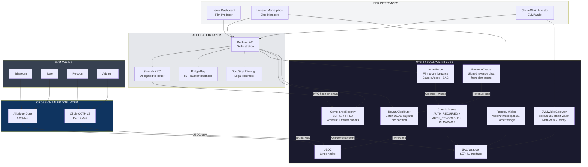
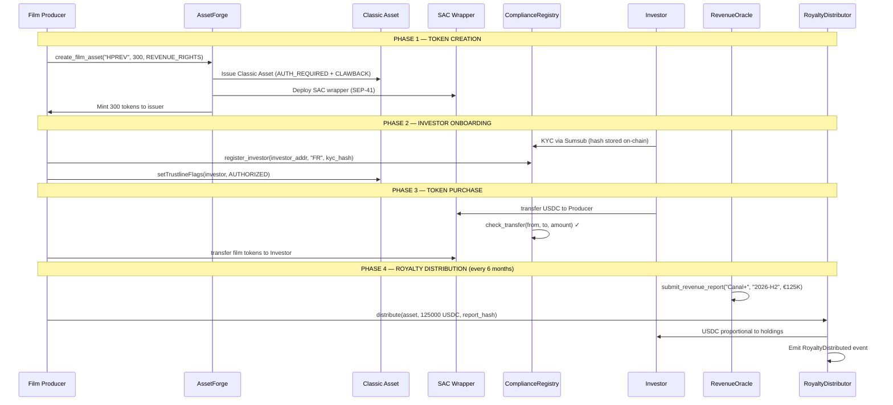
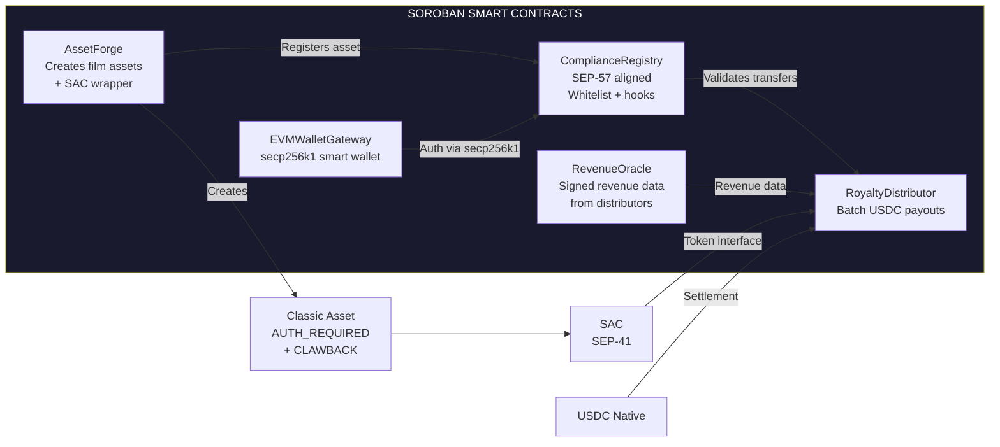
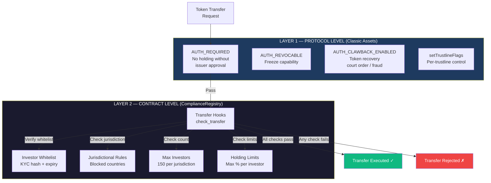
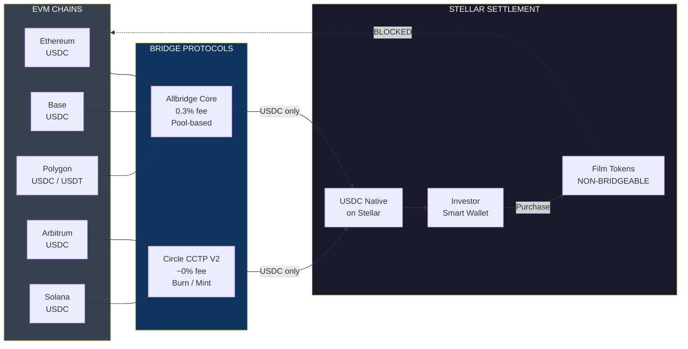
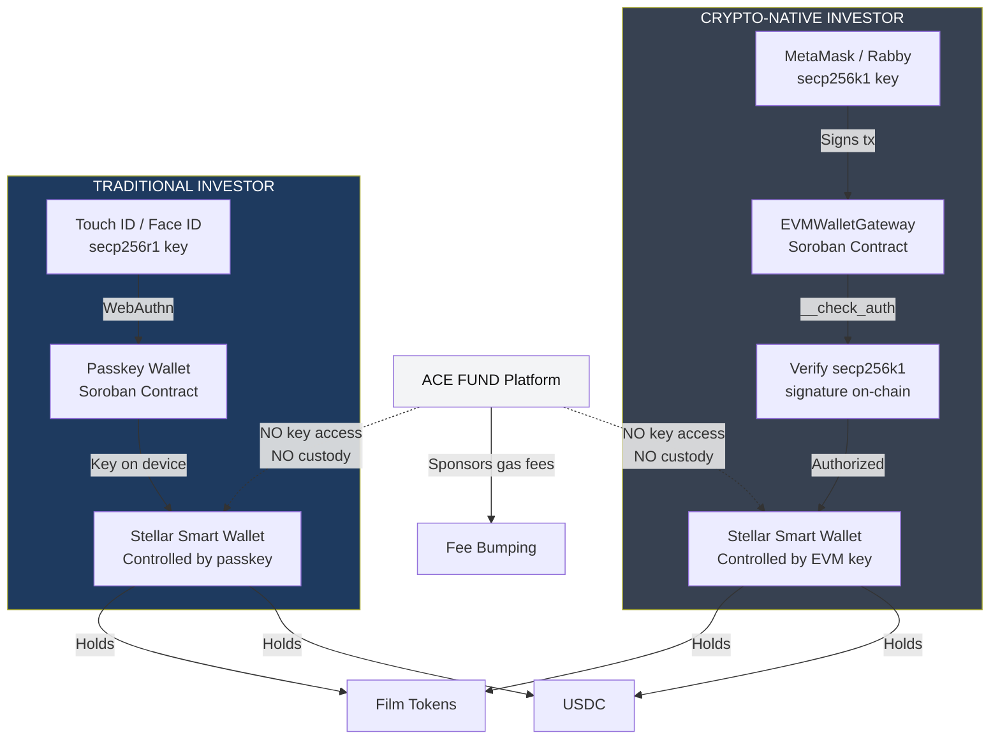
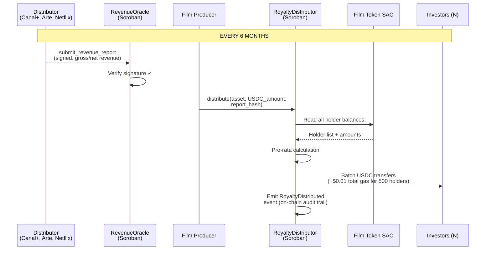
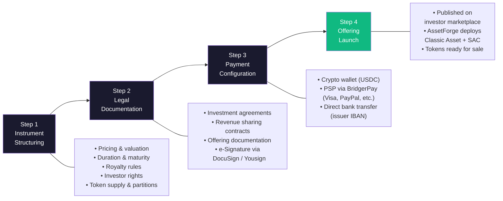
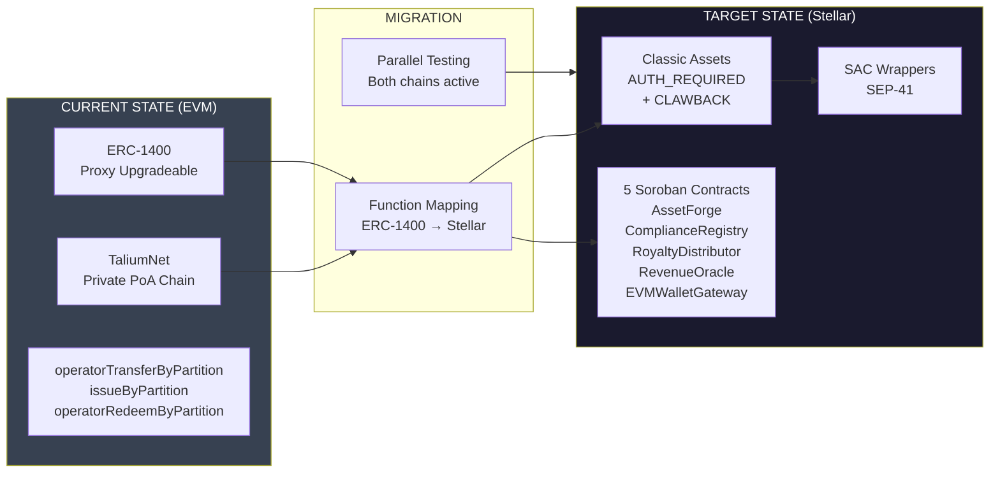

# Technical Architecture — ACE FUND

## Regulated Film Tokenization Rail on Stellar

---

**Project:** ACE FUND (by ACE Good)
**Category:** RWA — Tokenized Film Royalties & Revenue Rights
**Track:** Open Track — Build Award
**Website:** [acefund.io](https://www.acefund.io)

---

## Table of Contents

1. [Executive Summary](#1-executive-summary)
2. [Problem Statement](#2-problem-statement)
3. [Solution Overview](#3-solution-overview)
4. [Why Stellar](#4-why-stellar)
5. [Core On-Chain Architecture](#5-core-on-chain-architecture)
6. [Smart Contract Architecture](#6-smart-contract-architecture)
7. [Tokenization Flow](#7-tokenization-flow)
8. [Compliance Architecture](#8-compliance-architecture)
9. [Cross-Chain Liquidity Bridge](#9-cross-chain-liquidity-bridge)
10. [Wallet Architecture](#10-wallet-architecture)
11. [Royalty Distribution Engine](#11-royalty-distribution-engine)
12. [Off-Chain Infrastructure](#12-off-chain-infrastructure)
13. [Security Model](#13-security-model)
14. [DeFi Composability](#14-defi-composability)
15. [Milestone Roadmap](#15-milestone-roadmap)

---

## 1. Executive Summary

ACE FUND is a SaaS platform that enables film producers to tokenize revenue rights (royalties, box office receipts, TV distribution fees) and sell fractional ownership to investors. The platform has been operating on a private EVM chain (TaliumNet/Hyperledger Besu) since 2023, with **€1.2M+ in on-chain transactions** across 5 tokenized film projects, using the ERC-1400 security token standard.

This submission requests funding to **migrate and extend the tokenization infrastructure to Stellar**, replacing the private EVM chain with a public network while adding native compliance enforcement, cross-chain liquidity access, and automated royalty distribution via Soroban smart contracts.

**Key metrics:**
- €500K TV rights catalog tokenized (200 tokens × €2,500, 25%+ annual yield)
- €700K tokenized on a single film production (1.5M budget)
- 5 film projects tokenized, 15+ in pipeline
- CES Las Vegas 2024 Innovation Award
- Network of 100+ film directors and producers
- Invited speaker at the Academy of Motion Pictures (Oscars) and Cannes Film Festival

---

## 2. Problem Statement

Film financing relies on opaque, illiquid instruments accessible only to institutional investors or high-net-worth individuals. Independent producers with 10% funding gaps (typically €150K–€1.5M) have no efficient mechanism to reach retail investors.

**Current limitations on the private EVM chain:**

| Problem | Impact |
|---------|--------|
| Private PoA chain (TaliumNet) | No public verifiability, limited trust |
| No native stablecoin | Fiat on/off-ramp friction, no USDC settlement |
| Closed ecosystem | No access to DeFi liquidity or institutional capital pools |
| Third-party dependency | Talium operates the chain, ACE FUND has no sovereignty |
| EVM-only investors | Excludes Stellar-native institutional capital (Franklin Templeton, SG Forge, etc.) |

---

## 3. Solution Overview

Migrate from private EVM chain to Stellar public network using a hybrid Classic Asset + Soroban architecture.

### Global Architecture



### Film Token Lifecycle



---

## 4. Why Stellar

Stellar is not interchangeable with other chains for this use case. The following features are **structurally required** and either unavailable or prohibitively expensive on EVM chains:

### 4.1 Native Authorization Model

Film royalty tokens are regulated securities. Every transfer must be pre-approved by the issuer. Stellar's `AUTH_REQUIRED` flag enables this **at the protocol level**, not via a smart contract workaround:

- `AUTH_REQUIRED`: no wallet can hold tokens without explicit issuer approval
- `AUTH_REVOCABLE`: issuer can freeze tokens in case of regulatory action or investor non-compliance
- `AUTH_CLAWBACK_ENABLED`: issuer can recover tokens in case of fraud or court order — a legal requirement for securities in the EU

On Ethereum, these features require custom ERC-1400 logic that adds gas costs and attack surface. On Stellar, they are **native protocol operations** with zero additional complexity.

### 4.2 Authorization Sandwich Pattern

For per-transfer approval of regulated securities:

```
1. Issuer authorizes sender (AUTHORIZED_FLAG)
2. Issuer authorizes receiver (AUTHORIZED_FLAG)
3. Payment executes
4. Issuer revokes receiver to AUTHORIZED_TO_MAINTAIN_LIABILITIES
5. Issuer revokes sender to AUTHORIZED_TO_MAINTAIN_LIABILITIES
```

Each transfer is individually approved. This is the exact regulatory model required for securities transfers under MiFID II. On Stellar, this is a native 5-operation atomic transaction. On EVM, it requires custom hooks, modifiers, and gas-intensive state changes.

### 4.3 Classic Asset + SAC: Best of Both Worlds

- **Classic Asset issuance**: native, gas-efficient (~$0.00001/tx), with built-in authorization and clawback
- **SAC (Stellar Asset Contract)**: wraps the Classic Asset to expose the SEP-41 token interface to Soroban, enabling composability with smart contract logic (compliance hooks, distribution, oracle)
- This dual layer is unique to Stellar: **protocol-level security + smart contract programmability**

### 4.4 Native USDC

Circle issues USDC **directly on Stellar** — not wrapped, not bridged, fully native. This enables:
- Zero-bridge-risk settlement in USDC
- Royalty distributions directly in USDC to investor wallets
- Fiat off-ramp via Stellar anchors (MoneyGram, local partners) in 100+ countries
- CCTP V2 for native cross-chain USDC transfers (burn/mint, no wrapped tokens)

### 4.5 Cost Structure

Royalty distributions require batch payments to hundreds of investors every 6 months. At Stellar's ~$0.00001/tx, distributing to 500 investors costs < $0.01. On Ethereum mainnet, the same operation costs $50–500+ depending on gas prices.

### 4.6 Institutional Ecosystem

Stellar hosts Franklin Templeton ($580M+ tokenized treasuries), SG Forge (EUR CoinVertible), PayPal (PYUSD). Film royalty tokens on Stellar sit alongside institutional-grade RWA — increasing credibility and access to institutional LP capital.

---

## 5. Core On-Chain Architecture

### 5.1 Asset Model

Each film or catalog is represented as a **Stellar Classic Asset** with the following issuer account configuration:

```
Issuer Account (per film)
├── AUTH_REQUIRED_FLAG         = true
├── AUTH_REVOCABLE_FLAG        = true
├── AUTH_CLAWBACK_ENABLED_FLAG = true
├── Home Domain                = acefund.io
└── Asset Code                 = e.g., HPRES (High Pressure), MDFCATALOG
```

The Classic Asset is then wrapped via SAC to expose the SEP-41 interface:

```bash
stellar contract asset deploy \
  --source <issuer_keypair> \
  --network mainnet \
  --asset HPRES:<issuer_public_key>
```

The issuer account's keypair is held by the **film producer** (the legal issuer of the securities), not by ACE FUND. ACE FUND provides the tooling; the producer retains sovereignty.

### 5.2 Partition Model (ERC-1400 Equivalent)

On the existing EVM platform, film tokens use ERC-1400 partitions to separate different tranches of the same film (e.g., "revenue rights" vs "IP rights"). On Stellar, partitions are implemented as **separate Classic Assets issued by the same issuer account**:

```
Film: "High Pressure" (Issuer: GFILM...)
├── HPREV (Revenue Rights) — 300 tokens × €5,000
├── HPCAT (Catalog Rights) — future tranche
└── Each asset: AUTH_REQUIRED + CLAWBACK + SAC wrapper
```

This preserves the ERC-1400 partition semantics while leveraging Stellar's native asset model. The `AssetForge` Soroban contract automates the creation and configuration of these asset partitions.

---

## 6. Smart Contract Architecture

Five core Soroban contracts orchestrate the on-chain lifecycle:

### 6.1 Contract Overview



### 6.2 AssetForge

**Purpose:** Automates the creation of film token partitions on Stellar.

**Functions:**

```rust
pub fn create_film_asset(
    env: Env,
    issuer: Address,          // Film producer (must authorize)
    asset_code: String,       // e.g., "HPREV"
    total_supply: i128,       // e.g., 300 tokens
    partition_type: Symbol,   // REVENUE_RIGHTS | CATALOG_RIGHTS | IP_RIGHTS
    metadata_hash: BytesN<32> // IPFS hash of legal contract
) -> Address;                 // Returns SAC contract address

pub fn configure_issuer_flags(
    env: Env,
    issuer: Address
);
// Sets AUTH_REQUIRED + AUTH_REVOCABLE + AUTH_CLAWBACK_ENABLED
// on the issuer account via Stellar operations

pub fn get_film_assets(
    env: Env,
    issuer: Address
) -> Vec<FilmAsset>;
// Returns all partitions for a given film issuer
```

**Storage:** Persistent storage maps `issuer → Vec<FilmAsset>` where `FilmAsset` includes asset code, SAC address, total supply, partition type, and creation timestamp.

### 6.3 ComplianceRegistry (SEP-57 / T-REX Aligned)

**Purpose:** On-chain enforcement of investor whitelist and transfer restrictions. Aligned with the T-REX framework (ERC-3643 adapted to Stellar via SEP-57).

**Design:**

```rust
pub fn register_investor(
    env: Env,
    issuer: Address,         // Only the film producer can register
    investor: Address,       // Stellar address (Account or Contract)
    jurisdiction: Symbol,    // ISO 3166-1 country code
    kyc_hash: BytesN<32>,   // Hash of KYC verification result
    expiry: u64             // KYC validity timestamp
) -> Result<(), ComplianceError>;

pub fn revoke_investor(
    env: Env,
    issuer: Address,
    investor: Address
) -> Result<(), ComplianceError>;

pub fn check_transfer(
    env: Env,
    asset: Address,          // SAC address of the film token
    from: Address,
    to: Address,
    amount: i128
) -> Result<bool, ComplianceError>;
// Verifies:
// 1. Both sender and receiver are whitelisted
// 2. Receiver's KYC has not expired
// 3. Jurisdictional restrictions are respected
// 4. Max investor count per asset is not exceeded (150/jurisdiction)
// 5. Holding limits are respected

pub fn is_whitelisted(
    env: Env,
    investor: Address,
    asset: Address
) -> bool;

pub fn get_investor_count(
    env: Env,
    asset: Address,
    jurisdiction: Symbol
) -> u32;
// Returns number of registered investors per jurisdiction
// Used to enforce the 150-investor private placement limit
```

**Compliance Rules (configurable per asset):**

| Rule | Description | Default |
|------|-------------|---------|
| `max_investors_per_jurisdiction` | EU Prospectus Regulation limit | 150 |
| `max_holding_pct` | Maximum % of total supply per investor | 10% |
| `blocked_jurisdictions` | Sanctioned countries (OFAC, EU) | Configurable |
| `kyc_expiry_days` | KYC validity period | 365 days |
| `transfer_cooldown` | Minimum holding period | 0 (configurable) |

**Integration with Classic Asset authorization:**

The `ComplianceRegistry` works in tandem with the issuer's `AUTH_REQUIRED` flag. When an investor is registered:

1. `register_investor()` stores the investor in the on-chain whitelist
2. The platform backend calls `setTrustlineFlags(AUTHORIZED_FLAG)` on the investor's trustline
3. Transfers are double-checked: protocol-level (`AUTH_REQUIRED`) + contract-level (`check_transfer()`)

This two-layer enforcement ensures compliance even if the Soroban contract is bypassed via a direct Classic Asset operation.

### 6.4 RoyaltyDistributor

**Purpose:** Automates batch royalty payments in USDC to all token holders of a given film asset, proportional to their holdings.

**Functions:**

```rust
pub fn distribute(
    env: Env,
    issuer: Address,             // Must authorize
    asset: Address,              // SAC address of the film token
    usdc_amount: i128,           // Total USDC to distribute
    revenue_report_hash: BytesN<32> // Hash of signed revenue report
) -> DistributionResult;
// 1. Reads all token holders from the SAC balance entries
// 2. Calculates pro-rata share per holder
// 3. Executes batch USDC transfers via SAC
// 4. Emits distribution event with full breakdown
// 5. Links to revenue report hash for auditability

pub fn get_distribution_history(
    env: Env,
    asset: Address
) -> Vec<Distribution>;

pub fn get_investor_earnings(
    env: Env,
    investor: Address,
    asset: Address
) -> i128;
// Cumulative USDC received by this investor for this film
```

**Distribution events:**

```rust
#[contractevent]
pub struct RoyaltyDistributed {
    #[topic]
    asset: Address,
    #[topic]
    period: Symbol,          // e.g., "2026-H1"
    total_usdc: i128,
    holders_count: u32,
    revenue_hash: BytesN<32>,
}
```

**Gas optimization:** For films with 300 token holders, a single distribution requires ~300 USDC transfers. At Stellar's fee structure, total cost < $0.01. The contract processes holders in batches to stay within Soroban's per-transaction resource limits (200 write entries post-SLP-0004).

### 6.5 RevenueOracle

**Purpose:** On-chain publication of verified revenue data from film distributors (TV networks, theaters, streaming platforms). Provides investors with an independently verifiable link between off-chain film revenues and on-chain distribution payouts.

**Functions:**

```rust
pub fn submit_revenue_report(
    env: Env,
    reporter: Address,            // Authorized distributor or auditor
    asset: Address,               // Film token SAC address
    period: Symbol,               // "2026-H1"
    gross_revenue: i128,          // In cents (EUR or USD)
    net_distributable: i128,      // After deductions
    report_hash: BytesN<32>,      // IPFS hash of full report
    signature: BytesN<64>         // Ed25519 signature of the report
) -> Result<(), OracleError>;

pub fn add_authorized_reporter(
    env: Env,
    admin: Address,
    reporter: Address,
    name: String                  // e.g., "Canal+", "Arte"
) -> Result<(), OracleError>;

pub fn get_latest_report(
    env: Env,
    asset: Address
) -> Option<RevenueReport>;

pub fn get_cumulative_revenue(
    env: Env,
    asset: Address
) -> i128;
```

**Revenue report structure:**

```rust
pub struct RevenueReport {
    pub reporter: Address,
    pub period: Symbol,
    pub gross_revenue: i128,
    pub net_distributable: i128,
    pub report_hash: BytesN<32>,
    pub timestamp: u64,
    pub verified: bool,
}
```

**Trust model:** Revenue reports are submitted by authorized distributors (TV networks, sales agents) or third-party auditors. Each reporter is pre-registered via `add_authorized_reporter()`. Reports are signed off-chain and the signature is verified on-chain, ensuring data provenance.

### 6.6 EVMWalletGateway

**Purpose:** Smart wallet contract that enables investors with EVM wallets (MetaMask, Rabby) to interact with Stellar without managing a separate Stellar keypair.

**Mechanism:**

```rust
impl CustomAccountInterface for EVMWalletGateway {
    type Signature = BytesN<65>; // secp256k1 signature (r, s, v)
    type Error = GatewayError;

    fn __check_auth(
        env: Env,
        signature_payload: Hash<32>,
        signature: Self::Signature,
        auth_context: Vec<Context>,
    ) -> Result<(), Self::Error> {
        // 1. Recover the secp256k1 public key from the signature
        // 2. Derive the Ethereum address (keccak256 of pubkey)
        // 3. Verify it matches the registered EVM address
        // 4. Verify the signature covers the correct payload
    }
}

pub fn register(
    env: Env,
    evm_address: BytesN<20>,     // 0x... Ethereum address
    proof: BytesN<65>            // Signature proving ownership
) -> Address;
// Creates a new smart wallet contract instance
// Returns the Stellar contract address (C...)
// The EVM private key is the ONLY signer — self-custody

pub fn get_stellar_address(
    env: Env,
    evm_address: BytesN<20>
) -> Option<Address>;
```

**Self-custody guarantee:** The smart wallet contract can ONLY be operated by producing a valid secp256k1 signature from the registered Ethereum address. ACE FUND never has access to any private key. The investor signs transactions with MetaMask/Rabby, and the `__check_auth` function verifies the signature on-chain.

---

## 7. Tokenization Flow

### 7.1 Film Onboarding (Issuer Side)

```
Producer (Issuer)
      │
      ▼
1. Creates account on ACE FUND platform
2. Uploads legal documentation (revenue sharing contract, film budget)
3. Signs via DocuSign/Yousign
      │
      ▼
4. ACE FUND generates a Stellar keypair for the issuer
   (or links existing Stellar account)
5. AssetForge.create_film_asset() is called:
   - Creates Classic Asset with AUTH_REQUIRED + CLAWBACK
   - Deploys SAC wrapper
   - Registers asset metadata (IPFS hash of legal contract)
   - Mints total supply to issuer account
      │
      ▼
6. Film is listed on the ACE FUND marketplace
   Tokens are ready for sale
```

### 7.2 Investment Flow (Investor Side)

**Stellar-native or traditional investor:**

```
Investor
   │
   ▼
1. Creates account (email + passkey)
   → Soroban passkey wallet created automatically (WebAuthn)
   → Private key stored on device (Touch ID / Face ID)
   → Self-custody, ACE FUND has no key access
   │
   ▼
2. KYC via Sumsub (delegated to film producer)
   → On success: ComplianceRegistry.register_investor()
   → Investor's Stellar address whitelisted on-chain
   → Issuer sets trustline AUTHORIZED_FLAG
   │
   ▼
3. Payment: fiat via BridgerPay → on-ramp to USDC via Stellar anchor
   or: USDC on Stellar directly
   │
   ▼
4. Purchase: USDC transferred to issuer, film tokens transferred to investor
   → ComplianceRegistry.check_transfer() validates the transfer
   → AUTH_REQUIRED ensures protocol-level enforcement
   → Tokens arrive in investor's passkey wallet
```

**EVM-native investor:**

```
EVM Investor (MetaMask / Rabby)
   │
   ▼
1. Connects EVM wallet on ACE FUND platform
   → EVMWalletGateway.register() creates a Soroban smart wallet
   → Wallet is controlled by the investor's EVM private key (secp256k1)
   → Self-custody: no one else can sign transactions
   │
   ▼
2. KYC via Sumsub → ComplianceRegistry.register_investor()
   (same as above, using the Stellar smart wallet address)
   │
   ▼
3. Bridge USDC from EVM chain to Stellar:
   → Integrated Allbridge Core or Circle CCTP V2 in platform UI
   → Investor signs the bridge transaction with MetaMask (source chain)
   → USDC arrives on their Stellar smart wallet
   │
   ▼
4. Purchase: same as above
   → Investor signs with MetaMask
   → EVMWalletGateway.__check_auth() verifies secp256k1 signature
   → Transaction executes on Stellar
```

---

## 8. Compliance Architecture

### 8.1 Regulatory Framework

ACE FUND operates under the **EU private placement exemption** (Regulation EU 2017/1129):

| Requirement | Implementation |
|-------------|----------------|
| < 150 investors per EU Member State | `ComplianceRegistry.max_investors_per_jurisdiction` enforced on-chain |
| < €8M total consideration per 12 months | Tracked off-chain per issuer; on-chain cap configurable |
| No public solicitation | Private club model (membership required) |
| KYC/AML verification | Sumsub integration, delegated to issuer (producer) |
| Self-custody (no custody license required) | Passkey wallets (WebAuthn) + EVMWalletGateway (secp256k1) |

**ACE FUND's regulatory position:** ACE FUND is a **technology provider** (SaaS platform), not an investment intermediary. The film producer is the legal issuer of the securities and bears KYC/AML responsibility. ACE FUND provides the infrastructure (smart contracts, marketplace UI, KYC SDK integration) but does not hold tokens, funds, or investor data.

### 8.2 On-Chain Compliance Enforcement

**Two-layer model:**



**Why two layers:** Layer 1 catches any attempt to transfer tokens via direct Classic Asset operations (bypassing Soroban). Layer 2 adds granular business logic (jurisdiction checks, holding limits) that Classic Assets cannot express. Together, they provide **defense in depth**: even if one layer is compromised, the other enforces compliance.

### 8.3 Token Bridgeability Restriction

Film royalty tokens are **non-bridgeable by design**. The `AUTH_REQUIRED` flag prevents any wallet (including bridge contracts) from holding tokens without explicit issuer approval. Bridge contracts will never be whitelisted in the `ComplianceRegistry`.

**Only USDC is bridgeable.** Investors can bridge liquidity IN (USDC from any chain → Stellar) and bridge liquidity OUT (USDC from Stellar → any chain). The security tokens remain on Stellar at all times, under full compliance enforcement.

---

## 9. Cross-Chain Liquidity Bridge

### 9.1 Architecture



**Direction:** USDC flows IN for investment, OUT for distributions/exit. Film tokens are **non-bridgeable** — they remain on Stellar under full compliance enforcement at all times.

### 9.2 Supported Routes

| Source Chain | Bridge | Token | Status |
|-------------|--------|-------|--------|
| Ethereum | Allbridge Core | USDC, USDT | Live |
| Base | Allbridge Core | USDC | Live |
| Polygon | Allbridge Core | USDC, USDT | Live |
| Arbitrum | Allbridge Core | USDC | Live |
| Solana | Allbridge Core | USDC | Live |
| Any CCTP chain | Circle CCTP V2 | USDC (native) | Q1 2026 |

### 9.3 User Experience

The bridge is **embedded in the ACE FUND platform UI**. The investor does not interact with Allbridge or CCTP directly:

1. Investor clicks "Deposit from EVM" in the ACE FUND dashboard
2. MetaMask/Rabby popup asks to approve USDC transfer on source chain
3. Platform routes the transfer through Allbridge Core or CCTP V2
4. Trustline for USDC on Stellar is automatically established if needed
5. USDC arrives on the investor's Stellar wallet within 1-5 minutes
6. Investor can immediately purchase film tokens

---

## 10. Wallet Architecture

### 10.1 Wallet Architecture Overview



### 10.2 Two Wallet Types

| Type | User Profile | Technology | Signer | Custody |
|------|-------------|------------|--------|---------|
| **Passkey Wallet** | Traditional investor (club member) | Soroban smart wallet + WebAuthn (secp256r1) | Device biometrics (Touch ID / Face ID) | Self-custody |
| **EVM Gateway Wallet** | Crypto-native investor | Soroban smart wallet + secp256k1 verification | EVM private key (MetaMask/Rabby) | Self-custody |

### 10.2 Passkey Wallet Flow

Leverages Stellar's Protocol 21 secp256r1 verification for WebAuthn-compatible authentication:

- No seed phrase, no private key management for the user
- Authentication via fingerprint, Face ID, or hardware security key
- Gas fees sponsored by the platform (fee bumping)
- Wallet creation is invisible — user signs up with email, wallet exists in background

### 10.3 EVM Gateway Wallet Flow

The `EVMWalletGateway` contract implements the `CustomAccountInterface`:

- User connects MetaMask/Rabby once to register their EVM address
- A Soroban smart wallet is deployed, with the EVM address as sole signer
- All subsequent Stellar transactions are signed via MetaMask
- The `__check_auth` function recovers the secp256k1 public key and verifies ownership

**Key property:** The EVM private key is the sole signer. If the user loses access to their MetaMask, they lose access to their Stellar wallet — same security model as any self-custody wallet. ACE FUND cannot recover or access the wallet.

---

## 11. Royalty Distribution Engine

### 11.1 Distribution Process

Film royalties are distributed every 6 months for a duration of 30-40 years per film contract:



### 11.2 Revenue Guarantee Mechanism

ACE FUND structures each film tokenization with a **priority repayment waterfall**:

1. **First revenues** are allocated to token holders until initial investment + 25% is repaid
2. **Subsequent revenues** are split according to the contractual percentage (e.g., 10% to token holders)
3. **Tax credit mechanism** (CNC France: 30%, Tax Shelter Belgium: 45%): 12 months post-production, tax credits are released to the producer, who allocates a portion to repay investors

This waterfall is encoded in the legal contract (off-chain, signed via DocuSign). The on-chain component is the `RoyaltyDistributor` that executes the distributions as determined by the `RevenueOracle` data.

---

## 12. Off-Chain Infrastructure

### 12.1 Components

| Component | Technology | Purpose |
|-----------|------------|---------|
| **Backend API** | Node.js / Java | Orchestration, issuer management, marketplace logic |
| **KYC SDK** | Veriff / Sumsub API | Identity verification (delegated to issuer, provider selectable per issuer) |
| **Legal Signing** | DocuSign / Yousign | Revenue sharing contracts, investor agreements |
| **Payment Gateway** | BridgerPay | 80+ payment methods (Visa, PayPal, bank transfer, crypto) |
| **Direct Bank Transfer** | Issuer IBAN | Fiat payments sent directly to issuer's bank account (non-custodial) |
| **Cap Table Engine** | Backend database | Real-time ownership tracking per asset partition, dividend rights, investor registry, shareholder agreement enforcement |
| **Hosting** | OVH Cloud (EU) | GDPR-compliant, EU data residency |
| **IPFS** | Pinata / Infura | Legal contract storage, revenue report archives |

### 12.2 Issuer Workflow (SaaS Dashboard)

The platform provides a 4-step workflow for film producers to create and launch a tokenized offering:



**Key design choice:** Payment flows are configured so that funds transfer **directly from investor to issuer** (via BridgerPay, crypto wallet, or bank transfer). The platform never holds or intermediates funds. This is fundamental to the non-custodial architecture.

### 12.3 Cap Table Management

The platform maintains a real-time cap table for each tokenized film asset, synchronized between on-chain and off-chain state:

| Data Point | Source | Purpose |
|------------|--------|---------|
| Token balances (current) | Stellar ledger (SAC `balance()`) | Authoritative ownership record |
| Investor identity | Off-chain database (KYC records) | Maps Stellar addresses to verified identities |
| Distribution history | Stellar ledger (USDC transfers) | Cumulative dividends per investor |
| Shareholder agreements | IPFS (hash on-chain) | Legal contract backing each token position |
| Transaction history | Stellar ledger + off-chain logs | Full audit trail with tx hashes linked to investor records |

The cap table engine reconciles on-chain balances with off-chain investor records, ensuring that the issuer always has an accurate view of ownership, dividend rights, and compliance status. Transaction hashes from every on-chain operation are stored in the off-chain database and linked to the relevant investor, asset, and compliance records — enabling end-to-end auditability.

### 12.4 Data Separation

| Data | Storage | Reason |
|------|---------|--------|
| Token balances, transfers | Stellar ledger | On-chain verifiability |
| Investor whitelist, KYC hashes | Soroban contract (ComplianceRegistry) | On-chain compliance enforcement |
| Revenue reports (summary) | Soroban contract (RevenueOracle) | On-chain auditability |
| Distribution history | Stellar ledger (USDC transfers) | On-chain transparency |
| Investor PII (name, ID docs) | OVH Cloud (encrypted, issuer-controlled) | GDPR, data privacy |
| Cap table, ownership tracking | Backend database + Stellar ledger | Reconciled on/off-chain |
| Legal contracts (full text) | IPFS (hash on-chain) | Immutability + availability |
| Film metadata, marketing | Backend database | Operational data |
| Payment records, reconciliation | Backend database | Operational audit trail |

---

## 13. Security Model

### 13.1 Key Management

| Actor | Key Type | Storage | Risk Mitigation |
|-------|----------|---------|-----------------|
| Film producer (issuer) | Stellar keypair | Producer's custody | Multisig option (2-of-3) |
| Investor (passkey) | secp256r1 | Device secure enclave | WebAuthn standard |
| Investor (EVM) | secp256k1 | MetaMask/Rabby | EVMWalletGateway contract |
| Platform operations | Stellar keypair | HSM / KMS | Fee sponsoring only, no asset control |

### 13.2 Attack Surface Analysis

| Threat | Mitigation |
|--------|------------|
| Unauthorized token transfer | AUTH_REQUIRED + ComplianceRegistry whitelist (two-layer) |
| Platform compromise | Non-custodial: platform has no access to investor keys or funds |
| Issuer key compromise | Optional multisig on issuer account; clawback enables recovery |
| Bridge exploit (USDC) | Only USDC is bridgeable; film tokens are non-bridgeable by design |
| Revenue oracle manipulation | Multiple authorized reporters; signed reports with cryptographic verification |
| Smart contract vulnerability | Soroban Security Audit Bank (provided by SCF post-T3) |

### 13.3 Upgrade Path

All Soroban contracts are upgradeable via the `upgrade()` function, gated by admin authorization:

```rust
pub fn upgrade(env: Env, new_wasm_hash: BytesN<32>) {
    let admin: Address = env.storage().instance().get(&DataKey::Admin).unwrap();
    admin.require_auth();
    env.deployer().update_current_contract_wasm(new_wasm_hash);
}
```

Upgrade authority is held by the contract admin (initially ACE FUND, transferable to a multisig or DAO). A system event `["executable_update", old, new]` is emitted on every upgrade for auditability.

---

## 14. DeFi Composability

### 14.1 Future Integration Paths (Post-Grant)

Film royalty tokens, once established on Stellar, can integrate with the existing DeFi ecosystem:

| Protocol | Integration | Value |
|----------|-------------|-------|
| **Blend Protocol** | Film tokens as collateral for USDC borrowing | Investors can access liquidity without selling tokens |
| **Soroswap / Aquarius** | USDC/Film-token trading pairs | Secondary market liquidity |
| **DeFindex** | Vault strategy wrapping multiple film tokens | Diversified film investment product |

**Note:** DeFi integrations require solving the KYC constraint — only whitelisted investors can hold film tokens. Possible approaches include permissioned pools (whitelist-gated) or synthetic tokens. This is out of scope for this grant but represents a natural evolution.

### 14.2 Secondary Market

Film tokens can be traded on compliant secondary market platforms. ACE FUND is in discussion with two regulated secondary market operators (one on Cardano, one on Base). On Stellar, peer-to-peer transfers between whitelisted investors are natively supported via the `ComplianceRegistry.check_transfer()` hook.

---

## 15. ERC-1400 → Stellar Migration Strategy

### Migration Overview



The milestone roadmap and budget are detailed in the SCF application document (`candidature_acefund.md`).

---

## Appendix A — Existing Traction

### On-Chain Activity (TaliumNet / Hyperledger Besu)

| Metric | Value |
|--------|-------|
| Contract | MAD Films Coin (MDF) — ERC-1400 proxy upgradeable |
| Address | `0x0AA38721612b083eB8Ba17C9291449044C92A948` |
| Standard | ERC-1400 (Security Token with partitions) |
| Transactions | 25 confirmed (Jan 2025 — Apr 2026) |
| Functions called | `operatorTransferByPartition` (16x), `issueByPartition` (4x), `operatorRedeemByPartition` (2x), `transferByPartition` (1x) |
| Explorer | [TaliumNet Explorer](https://eth.talium.fr/address/0x0AA38721612b083eB8Ba17C9291449044C92A948) |

### Tokenized Assets

| Project | Type | Amount | Status |
|---------|------|--------|--------|
| TV Series Catalog (80 territories: Canal+, Arte, Al Jazeera, Radio-Canada) | Revenue rights | €500,000 (200 × €2,500) | Active, 25%+ annual yield |
| High Pressure (French-Spanish production, €15M budget) | Revenue rights | €700,000 | Active, 1.5M tokenized tranche |
| Independent Film (recurring director) | Revenue rights | €21,000+ | Active since Jan 2026 |
| 2 additional films | Revenue rights | Various | Listed |
| **Pipeline** | Various | **15+ films** | In preparation |

### Recognition

- **CES Las Vegas 2024** — Innovation Award for film tokenization model
- **Academy of Motion Pictures** (Oscars) — Invited for tokenization partnership
- **Cannes Film Festival** — Invited speaker
- **CES Las Vegas 2026** — Invited speaker on film tokenization

### Team

| Name | Role | Background |
|------|------|------------|
| Grégory Monfort | CEO | 15+ years in audiovisual production. Founded ACE Good (2021) and ACE Fund. Network of 100+ film directors/producers worldwide. |
| François de Chezelles | CTO | 25+ years IT, MSc MIT. Co-founder of Talium (blockchain ESN, 2012). 100+ tokenization operations. Built the ERC-1400 framework used by ACE Fund. |
| Mehdi Terbeche | Investor Relations | Investment structuring background. Private equity experience. |
| Alicya Mendes | COO | 15+ years in operations and business development. |
| Jacques Soucquières | CFO | Former Crédit Foncier asset manager. Traditional finance background. |

---

## Appendix B — ERC-1400 to Stellar Migration Reference

| ERC-1400 Function | Stellar Equivalent |
|--------------------|--------------------|
| `issueByPartition(bytes32, address, uint256, bytes)` | `AssetForge.create_film_asset()` + `mint()` via SAC |
| `operatorTransferByPartition(bytes32, address, address, uint256, bytes, bytes)` | Classic Asset `payment` op with Authorization Sandwich + `ComplianceRegistry.check_transfer()` |
| `operatorRedeemByPartition(bytes32, address, uint256, bytes, bytes)` | `clawback()` via SAC or `burn()` by holder |
| `transferByPartition(bytes32, address, uint256, bytes)` | SEP-41 `transfer()` via SAC (gated by AUTH_REQUIRED + ComplianceRegistry) |
| `balanceOfByPartition(bytes32, address)` | SEP-41 `balance()` on partition-specific SAC |
| `partitionsOf(address)` | `AssetForge.get_film_assets()` per issuer |
| `isOperator(address, address)` | Stellar account signers / multisig |
| `authorizeOperator(address)` | `setOptions` (add signer to issuer account) |
| `canTransfer(bytes32, address, address, uint256, bytes)` | `ComplianceRegistry.check_transfer()` |

---

## Appendix C — SEP Alignment

| SEP | Usage in ACE FUND |
|-----|-------------------|
| **SEP-10** | Web Authentication for investor login (challenge-response, JWT) |
| **SEP-41** | Token Interface for all film assets via SAC |
| **SEP-57** | T-REX compliance framework: ComplianceRegistry hooks, investor whitelist, transfer restrictions |
| **SEP-6/24** | Fiat on/off-ramp via Stellar anchors for traditional investors |
| **SEP-1** | stellar.toml declaration of film assets and issuer information |
